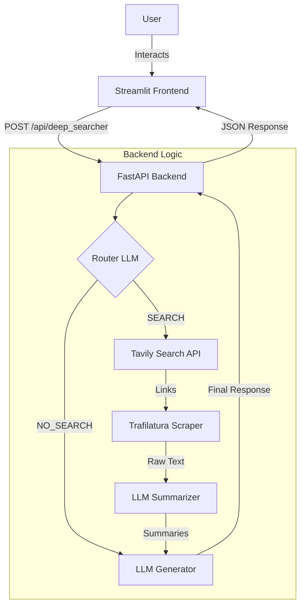

# Deep Searcher

**Deep Searcher** is an intelligent AI assistant that bridges the gap between static knowledge and real-time information. It dynamically decides whether to answer a user's query using its internal knowledge base or by performing a deep web search for the latest data.

---

## 🏗️ Architecture

The system follows a modern client-server architecture, orchestrating multiple AI services to deliver accurate results.



---

## 🌟 Special Features

### 💰 Smart Cost Management (Hybrid Approach)
Unlike systems that rely solely on expensive search API tokens for content retrieval, **Deep Searcher** uses a cost-effective hybrid strategy:
*   **Tavily API** is used *only* for finding high-quality links and metadata.
*   **Trafilatura** (an open-source scraper) is then used to extract the actual content from those links.
*   **Result:** Significantly reduced API costs without compromising on the quality of sources.

### ⚡ Efficient Parallel Summarization
To minimize latency during deep research, the system employs **asynchronous parallel processing**:
*   Multiple web pages are scraped and processed simultaneously.
*   The **LLM Summarizer** runs concurrently on each article.
*   **Result:** Drastically faster response times, even when analyzing multiple lengthy documents.

---

## ⚙️ How It Works

1.  **Input Analysis:** The user sends a message through the Streamlit UI.
2.  **Smart Routing:** The **Router LLM** analyzes the intent.
    *   *Simple/Creative queries* (e.g., "Write a poem") -> routed directly to the Generator.
    *   *Fact-based/Recent queries* (e.g., "Latest stock prices") -> routed to the **Search Module**.
3.  **Deep Research (If Search is triggered):**
    *   **Search:** Queries the **Tavily API** to find high-quality, relevant sources.
    *   **Scrape:** Uses **Trafilatura** to extract clean text from the identified webpages.
    *   **Summarize:** Condenses the scraped content into key facts using a dedicated LLM step.
4.  **Response Generation:** The final LLM combines the user's query with either the conversation history or the freshly gathered research context to generate a comprehensive answer.

---

## 💻 Tech Stack


*   **Core:** Python 3.10+
*   **Web Search:** [Tavily API](https://tavily.com/)
*   **Scraping:** [Trafilatura](https://trafilatura.readthedocs.io/)
*   **Environment:** Python-Dotenv

---

## 🚀 Key Features

*   **🧠 Intelligent Routing:** Automatically detects when external data is needed.
*   **🔎 Deep Web Research:** Goes beyond snippets by scraping and summarizing full articles.
*   **💬 Context-Aware:** Maintains full conversational history for natural interactions.
*   **✨ Unified Interface:** A clean, chat-based UI that transparently shows when the web is being accessed.

---

## 📂 Project Structure

```bash
Lumofy/test/
├── backend/              # FastAPI Backend
│   ├── main.py           # Application entry point
│   ├── api/              # API Routes and Schemas
│   └── services/         # Business Logic (LLM, Search)
├── frontend/             # Streamlit Frontend
│   └── app.py            # User Interface
├── .env                  # Environment Variables
├── requirements.txt      # Project Dependencies
└── README.md             # Project Documentation
```

---

## 🛠️ Setup & Installation

### Prerequisites
*   Python 3.10 or higher
*   **OpenAI API Key**
*   **Tavily API Key**

### Installation

1.  **Clone the repository**:
    ```bash
    cd path/to/project
    ```

2.  **Install dependencies**:
    ```bash
    pip install -r requirements.txt
    ```

3.  **Configure Environment Variables**:
    Create a `.env` file in the root directory and add your keys:
    ```env
    OPENAI_API_KEY=your_openai_api_key_here
    TAVILY_API_KEY=your_tavily_api_key_here
    ```

---

## 🚀 Usage

Run the backend and frontend in separate terminals.

### 1. Start the Backend API
```bash
uvicorn backend.main:app --reload
```
*Server running at `http://127.0.0.1:8000`*

### 2. Start the Frontend UI
```bash
streamlit run frontend/app.py
```
*Opens the chat interface in your browser.*

---

## 🔌 API Reference

**POST** `/api/deep_searcher`

The primary endpoint for processing user messages.

**Request:**
```json
{
  "query": "Who won the Super Bowl in 2025?",
  "history": []
}
```

**Response:**
```json
{
  "reply": "The Super Bowl LIX was won by...",
  "router_decision": "SEARCH"
}
```
