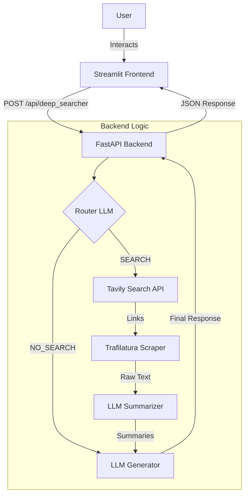

# 💻 Tech Stack


*   **Core:** Python 3.10+
*   **Web Search:** [Tavily API](https://tavily.com/)
*   **Scraping:** [Trafilatura](https://trafilatura.readthedocs.io/)
*   **Environment:** Python-Dotenv

---

# Deep Searcher

**Deep Searcher** is an intelligent AI assistant that bridges the gap between static knowledge and real-time information. It dynamically decides whether to answer a user's query using its internal knowledge base or by performing a deep web search for the latest data.

---

##  Architecture

The system follows a modern client-server architecture, orchestrating multiple AI services to deliver accurate results.



---

##  Special Features

### 💰 Smart Cost Savings
Most tools pay for every character they search. **Deep Searcher** uses a smart hybrid approach:
* **Tavily API** finds the best high-quality links (low cost).
* **Trafilatura** scrapes the actual content from those links (free).
* **Result:** High-quality research at a fraction of the cost.

### ⚡ Async Speed (reducing latency)
We don't wait for pages to load one by one. The system scrapes and summarizes all sources **in parallel**, cutting wait times significantly.

---

##  How It Works

1.  **Router:** An AI checks if your question needs live web data (e.g., "Stock Price") or just internal knowledge (e.g., "Write a poem").
2.  **Research (If Search is needed):**
    * **Find:** Gets the top 3 relevant links via Tavily.
    * **Scrape:** Extracts clean text using Trafilatura.
    * **Summarize:** Condenses all sources simultaneously using async processing.
3.  **Answer:** The LLM combines the fresh research with your chat history to give a clear, cited response.

---


##  Project Structure

```bash
Lumofy/test/
├── backend/              # FastAPI Backend
│   ├── main.py           # Application entry point
│   ├── api/              # API Routes and Schemas
│   └── services/         # Business Logic (LLM, Search)
├── frontend/             # Streamlit Frontend
│   └── app.py            # User Interface
├── .env                  # Environment Variables
├── requirements.txt      # Project Dependencies
└── README.md             # Project Documentation
```

---

##  Setup & Installation

### Prerequisites
*   Python 3.10 or higher
*   **OpenAI API Key**
*   **Tavily API Key**

### Installation

1.  **Clone the repository**:
    ```bash
    cd path/to/project
    ```

2.  **Install dependencies**:
    ```bash
    pip install -r requirements.txt
    ```

3.  **Configure Environment Variables**:
    Create a `.env` file in the root directory and add your keys:
    ```env
    OPENAI_API_KEY=your_openai_api_key_here
    TAVILY_API_KEY=your_tavily_api_key_here
    ```

---

## 🚀 Usage

Run the backend and frontend in separate terminals.

### 1. Start the Backend API
```bash
uvicorn backend.main:app --reload
```
*Server running at `http://127.0.0.1:8000`*

### 2. Start the Frontend UI
```bash
streamlit run frontend/app.py
```
*Opens the chat interface in your browser.*

---

## 🔌 API Reference

**POST** `/api/deep_searcher`

The primary endpoint for processing user messages.

**Request:**
```json
{
  "query": "Who won the Super Bowl in 2025?",
  "history": []
}
```

**Response:**
```json
{
  "reply": "The Super Bowl LIX was won by...",
  "router_decision": "SEARCH"
}
```
